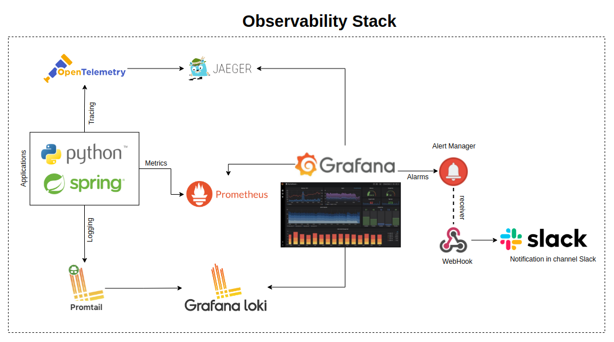

### Observability-Stack




### Logging
Os Logs são enviados para o logdriver do Grafana Loki, onde é possível visualizar os logs no Explorer do Grafana, selecionando o datasource Loki.

### Metrics
As aplicações expõem as métricas para o prometheus server, que pode ser visualizada nos dashboards Spring Boot 2.1 Statistics e Python Process.

### Tracing
O OpenTelemetry e Jaeger [in progress].

### Alerts
Os alertas de disponibilidade das aplicações são enviados para o Alert Manager que envia um webhook para o canal do slack #alerts

----
## Repository Structure

```
.
├── app                         >> Apps
│   ├── python-app
│   └── spring-app
├── configs
│   ├── alertmanager            >> Config Webhook Slack
│   ├── grafana                 >> Configs Grafana
│   │   ├── dashboards
│   │   └── provisioning
│   │       ├── dashboards
│   │       └── datasources
│   ├── loki                    >> Configs Loki
│   ├── prometheus              >> Configs prometheus Server
│   └── promtail                >> Configs promtail
├── img
└── k6                          >> Script k6 to run test get
```


# Compilar app
mvn package
mvn compile

# Subir app
java -jar target/observability-app-2.5.6.jar

# Buildando a imagem java
docker build -t spring-app:latest .


URLs Apps:
Spring-app: http://127.0.0.1:8080/
    Route health check: http://127.0.0.1:8080/actuator/health
    Metrics prometheus: http://127.0.0.1:8080/actuator/prometheus

Python-app: x   x   http://127.0.0.1:8081/
    Metrics prometheus: http://127.0.0.1:8082/metrics


URLs tools:
Grafana:            http://localhost:3000/
Jaeger:             http://localhost:16686/
Prometheus Alarms:  http://127.0.0.1:9090/alerts
Prometheus Server:  http://127.0.0.1:9090/targets


http://127.0.0.1:9080/config
http://localhost:16686/search


{compose_service="spring-app"}


https://www.jaegertracing.io/
https://grafana.com/docs/grafana/next/datasources/aws-cloudwatch/
https://grafana.com/docs/loki/latest/clients/docker-driver/